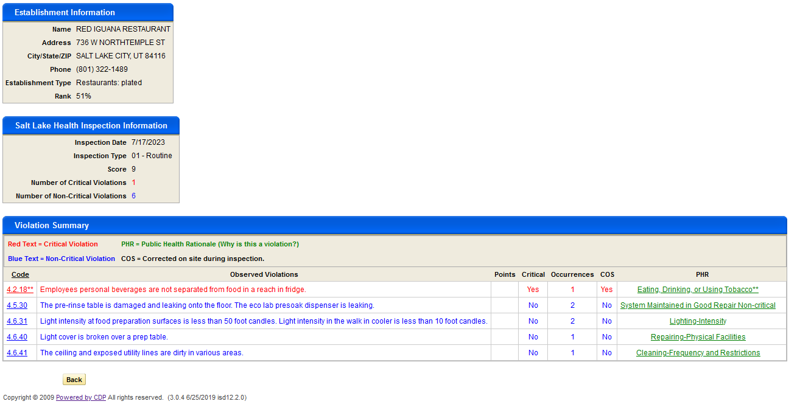
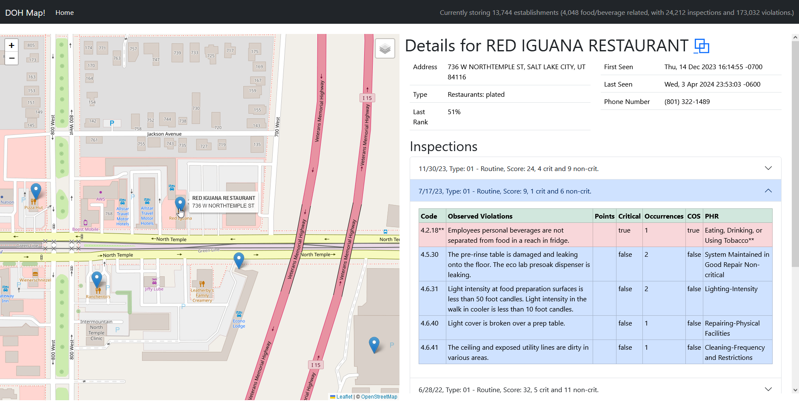
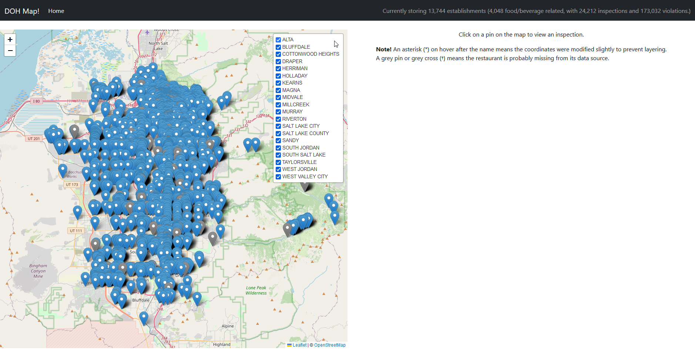

# DOH Map!
_Mapping Salt Lake County health inspections._

### Turn this:

### Into this!

#### Full map view:

## Contributing

You need a Postgres database to run the project.

Copy the `src/main/resources/application-local.example.yml` file to `src/main/resources/application.yml` and set up your
database. If you want to run the Selenium indexers, set `dohmap.selenium.sessions` to be over 0, set a login, and head
to `/admin` to test the scrapers.

## Brief

This projects ingests data from Salt Lake
County's [health inspection database](https://public.cdpehs.com/UTEnvPbl/VW_EST_PUBLIC/ShowVW_EST_PUBLICTablePage.aspx)
by means of scraping most of the data available on the site through concurrent Selenium browser sessions.

The scrapers are kicked off using a cronjob, which, by default, starts every Monday through Thursday at 21:00 local
system time for a quick (lite) run. The lite run does not check for new violations on inspections already in the
database.

A full run (which acts as if there is no data, so it checks all inspections) happens at Friday at 21:00, in-case the
health department does change older inspections (this is currently unknown, it would only add violations and not remove
existing ones.)

For an idea on timings between the two different runs, a single page for a lite run takes a little over 6 minutes,
whereas a full run will take about 14 minutes. A lite run, on my server, takes about 4 hours to complete. A full run
takes 10 hours, dividing the pages between 4 browsers.

These can be overridden using the `dohmap.jobs.full-run` and `dohmap.jobs.lite-run` properties.

Selenium was used because there is no API and their frontend/backend seems to _heavily_ sync state using JS. Seriously,
to view an inspection page calls some JS function that only increments an ID based on the index of the row.

The webpages are rendered server-side using Thymeleaf. Bootstrap is used as the front-end framework, Leaflet to display
the maps, and jQuery 'cause it's old school ;) and I don't need much else.

Within the database, IDs are stored
as [uuidv7](https://buildkite.com/blog/goodbye-integers-hello-uuids), which also act as a `created_on` timestamp for all
entities. The `com.github.f4b6a3:uuid-creator` library is used for this. If you want to convert uuidv7 IDs to SQL
timestamps (such as `timestamp with time zone`) within Postgres,
install the [pg-uuidv7](https://pgxn.org/dist/pg_uuidv7/) extension.

## Assumptions about their data model

Salt Lake County's health inspections uses Oracle DB for their datastore.

Unfortunately, since the site they use seems pretty old (check it out! they use XP-themed tables and such), they do not
expose any IDs of any kind.

Restaurant distinctiveness is currently determined if the name, address, city, state, ZIP, phone, and establishment type
match, if they don't, a new restaurant is created. Same with all inspection and violation fields.

Running the Selenium browsers _shouldn't™_ recreate data, but there are probably bugs. If a restaurant gets a new phone
number, or changes their name, there'll be a new restaurant as there don't seem to be any exposed unique identifiers.

## The future?!

* Account sign-up
* Alerts if establishments you select match criteria (critical violations on new inspection)
    * Discord alert destination
* Merge establishments
